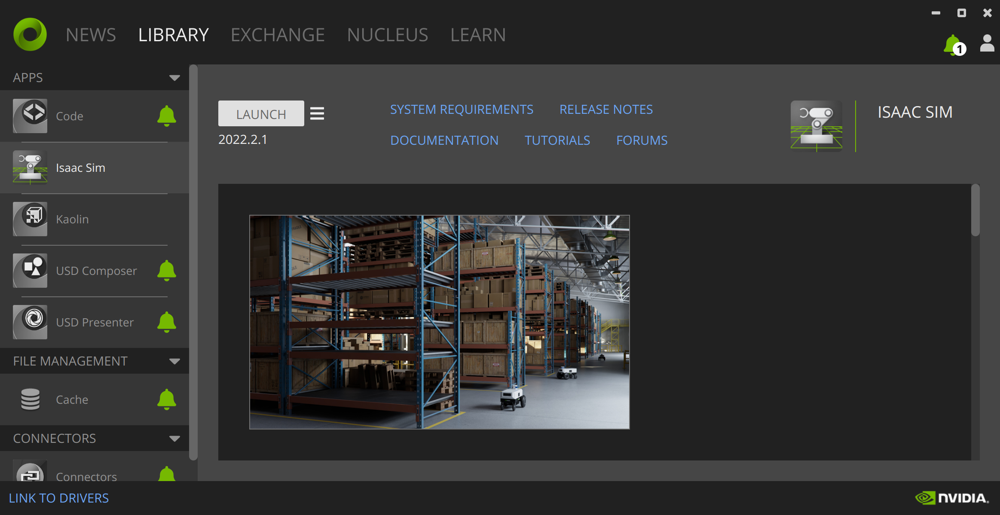

# Tac-Man: Simulation Studies


**IEEE Transactions on Robotics (T-RO) 2024**

[[Website]](https://tacman-aom.github.io/) | [[Paper]](https://arxiv.org/pdf/2403.01694)

In [*Tac-Man: Tactile-Informed Prior-Free Manipulation of Articulated Objects*](https://arxiv.org/abs/2403.01694), we present a prior-free strategy for articulated object manipulation leveraging tactile sensors. This approach has been validated through extensive real-world experiments, and here we present our simulation studies for further large-scale validation.

This repository hosts the code for the simulation studies as detailed in our paper. For a comprehensive understanding, please consider reading the full paper.


## Preparing Environment

### Install Omniverse Isaac Sim

Installation of Omniverse Isaac SimOur simulations run on [NVIDIA Isaac Sim](https://developer.nvidia.com/isaac-sim), which is part of the NVIDIA Omniverse platform. Ensure that you install the Isaac Sim 2022.2.1 for compatibility with our code. We are actively working on supporting later versions.



Post-installation, the simulation environment can be initiated using the provided Python script. It is advisable to use an alias, as suggested in the official documentation:

```shell
alias omni_python='~/.local/share/ov/pkg/isaac_sim-2022.2.1/python.sh'
```

Next, we need a few additional packages:

```shell
omni_python -m pip install trimesh tqdm bezier 
```

### Download Pre-Processed Martnet-Mobility / GAPartNet Data

We evaluate our methods on a subset of objects from the [PartNet-Mobility dataset](https://sapien.ucsd.edu/browse). We also use annotations from [GAPartNet](https://pku-epic.github.io/GAPartNet/) for initializing grasps.

The datasets have been pre-processed to include extra details (see Appx. C of our paper.). To access the pre-processed data, please fill out the [GAPartNet Dataset Application Form](https://docs.google.com/forms/d/e/1FAIpQLScwiy7eVV2FtZQM1WI52du2OdWemiEAnxrfiU_X3W_CZ857NA/viewform) to comply with GAPartNet's terms and conditions. Once completed, download data from the link below and extract the data into data/gapartnet/.

Data link: [Google Drive](https://drive.google.com/file/d/1TLnew72muLTzfdR52k-IJJvnGIBUnk7J/view?usp=sharing).

### Download Playboards

Please download the data from the link below and unzip the contents to `data/playboards/`

Data link: [Google Drive](https://drive.google.com/file/d/1tauGi1q6P2WETF5cpdkD6qP3bhslK_Sf/view?usp=sharing).

## Start Simulation

For objects from PartNet-Mobility, please run:

```shell
omni_python run_partnet.py
            --idx       # Test case index, 0 by default.
            --obj_scale # object scaling, 0.5 by default
            --x_offset  # x-axis offset of robot base, 0.75 by defualt
            --y_offset  # y-axis offset of robot base, 0.0  by defualt
            --z_offset  # z-axis offset of robot base, 0.0  by defualt
            --headless  # run simulation in headless mode
            --capture   # record the simulation with Replicator
            --device    # computing device for transformation and states, "cuda" by default
```

For each case, we have pre-annotated grasps and robot base positions as initialization data in `data/gapartnet/grasps.json`.


For playboards with Bezier trajectories, run:

```shell
omni_python run_playboard.py
            --n_ctrl    # amount of control points of the Bezier curve
            --id        # test case index (under each `n_ctrl`)
            --x_offset  # x-axis offset of robot base, 0.5 by defualt
            --y_offset  # y-axis offset of robot base, 0.0 by defualt
            --z_offset  # z-axis offset of robot base, 0.0 by defualt
            --inverse   # run the trajectory in reverse
            --headless  # run simulation in headless mode
            --capture   # record the simulation with Replicator
            --device    # computing device for transformation and states, "cuda" by default
```


## Important note

### Setting the Base Positions for Fixed Manipulator

We find that the correct positions of the robot base are critical to avoid joint limits during interactions. This problem is caused by limited workspace and could be solved by using mobile manipulators rather than fixed robot arms with limited workspace. For simplicity, we provide proper robot placements in `data/...`, with which the robot should be able to finish the manipulation. If it is stuck at some point, retry with an adjusted base position.

### Mimicking Gripper Compliance with Rigid Body Simulation

We use a simple heuristic `lock_joint_drive(...)` and `release_joint_drive(...)` to mimic gripper compliance. Please refer to Appx. B of our paper. Our follow-up work [Taccel](https://taccel-simulator.github.io/) proposes an IPC-based VBTS simulator, where Tac-Man is implemented with the sensor simulated as soft bodies with high precision.

#### Paralleled Environment

While the codebase is designed with parallel evaluation in mind, the implementation is not yet complete. We aim to introduce this feature in future updates.

## Known Issues

1. Some URDF files cannot be imported properly when launching `run_partnet.py` using Isaac Sim 2023.

## Contact and Reference

If you encounter issues or have questions, please open a GitHub issue or contact Yuyang (y.li@stu.pku.edu.cn). 

If you find our research beneficial, we appreciate citations to our paper:

```bibtex
@article{zhao2024tac,
  title={Tac-Man: Tactile-Informed Prior-Free Manipulation of Articulated Objects},
  author={Zhao, Zihang and Li, Yuyang and Li, Wanlin and Qi, Zhenghao and Ruan, Lecheng and Zhu, Yixin and Althoefer, Kaspar},
  journal={IEEE Transactions on Robotics (T-RO)},
  year={2024}
}
```
