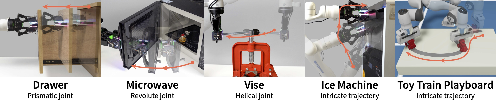
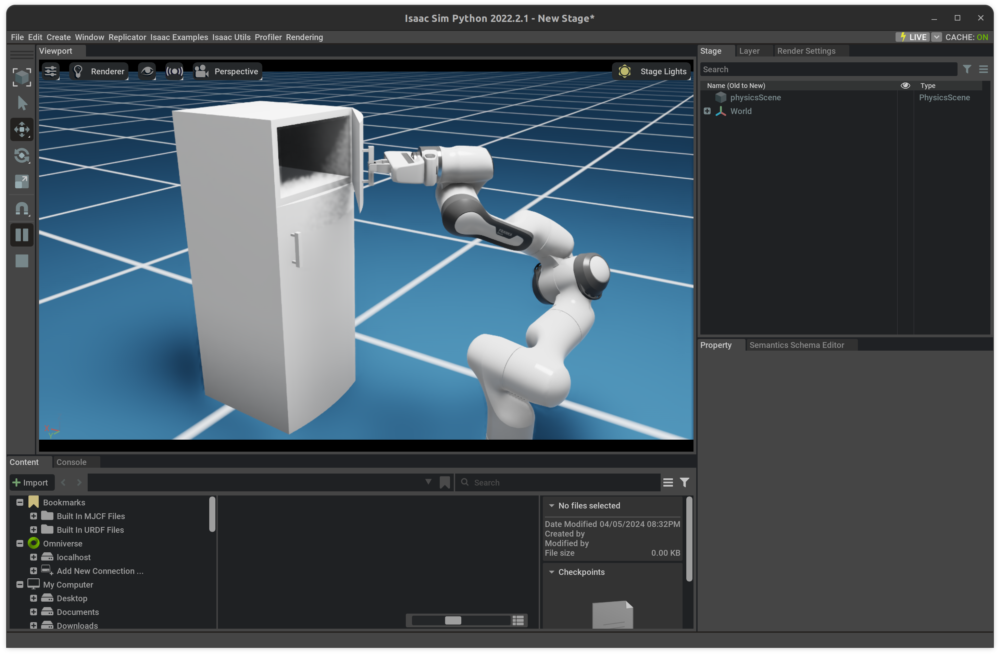
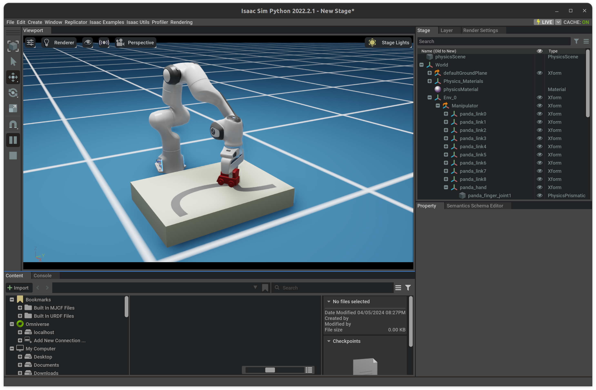

# Tac-Man: Simulation Studies



Integrating robotics into human-centric environments such as homes, necessitates advanced manipulation skills as robotic devices will need to engage with articulated objects like doors and drawers. In [*Tac-Man: Tactile-Informed Prior-Free Manipulation of Articulated Objects*](https://arxiv.org/abs/2403.01694), we present a prior-free strategy for articulated object manipulation leveraging tactile sensors. Extensive real-world experiments has demonstrated its efficacy, and we also include simulation studies for large-scale verification.

This repo contains codes for the simulation studies of the paper. For more details, please refer to our paper.

## Preparing Environment

### Install Omniverse Isaac Sim

Our simulation is built in [NVIDIA Isaac Sim](https://developer.nvidia.com/isaac-sim). You need to [download NVIDIA Omniverse](https://www.nvidia.com/en-us/omniverse/download/) and install the simulator. Our code should be compatible with **Isaac Sim 2022.2.1**. Support for later versions are on the way.

After installation, we need to launch Python via `.local/share/ov/pkg/isaac_sim-VERSION/python.sh` to start the simulation. As recommended by the official docs, we will asume an alias set:

```shell
alias omni_python=~/.local/share/ov/pkg/isaac_sim-2022.2.1/python.sh'.
```

We need a few additional packages:

```shell
omni_python -m pip install trimesh tqdm bezier 
```

### Download Pre-Processed Martnet-Mobility / GAPartNet Data

We evaluate our methods on a subset of objects from the [PartNet-Mobility dataset](https://sapien.ucsd.edu/browse). We also use annotations from [GAPartNet](https://pku-epic.github.io/GAPartNet/) for initializing grasps.

We pre-process these data by adding additional annotations. For simplicity, we provide pre-processed data here. Before downloading them, you need to go to [GAPartNet Dataset Application Form](https://docs.google.com/forms/d/e/1FAIpQLScwiy7eVV2FtZQM1WI52du2OdWemiEAnxrfiU_X3W_CZ857NA/viewform), which means that you agree to the T&C of the GAPartNet. Then, please download the data from here and unzip its contents to `data/gapartnet/`.

### Download Playboards

Playboard data are available here. Please download it and unzip the contents to `data/playboards/`


## Start Simulation

For PartNet-Mobility data, please run:

```shell
omni_python run_partnet.py
            --idx       # Test case index, 0 by default.
            --obj_scale # object scaling, 0.5 by default
            --x_offset  # x-axis offset of robot base, 0.75 by defualt
            --y_offset  # y-axis offset of robot base, 0.0  by defualt
            --z_offset  # z-axis offset of robot base, 0.0  by defualt
            --headless  # run simulation in headless mode
            --capture   # record the simulation with Replicator
            --device    # computing device for transformation and states, "cuda" by default
```

For each case, we have pre-annotated grasps and robot base positions as initialization data in `data/gapartnet/grasps.json`.




For playboards with Bezier trajectories, run:

```shell
omni_python run_playboard.py
            --n_ctrl    # amount of control points of the Bezier curve
            --id        # test case index (under each `n_ctrl`)
            --x_offset  # x-axis offset of robot base, 0.5 by defualt
            --y_offset  # y-axis offset of robot base, 0.0 by defualt
            --z_offset  # z-axis offset of robot base, 0.0 by defualt
            --inverse   # run the trajectory in reverse
            --headless  # run simulation in headless mode
            --capture   # record the simulation with Replicator
            --device    # computing device for transformation and states, "cuda" by default
```



## Codebase Workthrough

- `run_partnet.py` and `run_playboard.py` are simulation scripts.
- `data/playboard` includes data for playboards
  - each test case is in a subfolder: `n_ctrl/id`
- `utils/sim_consts.py` includes constant values and hyperparameters
- `utils/utils_3d.py` and `utils_sim.py` provides auxilliary functions.


### Important note

#### Setting the Base Positions for Fixed Manipulator

We find that the robot base position is crutial for the interaction, and inproper placement may cause one or some joints get stuck by the limit when interacting with objects from the PartNet-Mobility dataset. This problem should be solved by using mobile manipulators rather than fixed robot arms with limited workspace. For simplicity, we provide proper robot placements in `data/...`, where the robot should be able to finish the manipulation. If it is stuck at some point, retry with an adjusted base position.

#### Mimicing Gripper Compliance with Rigid Body Simulation

Due to the some bugs in the [deformable body simulation within Isaac Sim](https://docs.omniverse.nvidia.com/extensions/latest/ext_physics/deformable-bodies.html), we use a simple heuristic `lock_joint_drive(...)` and `release_joint_drive(...)`

#### Paralleled Environment

The implementation of the state machine is targeted for parallel evaluation. It is not completed due to the limited time, but we plan to implement this in the future.

## Known Issues

1. Some URDF cannot be imported properly when launching `run_partnet.py` using Isaac Sim 2023.

## Contact and Reference

For any questions, please tell us with issues or contact Yuyang (liyuyang20@mails.tsinghua.edu.cn).

If you find our work insightful, please consider citing us:

```bibtex
@article{zhao2024tac,
  title={Tac-Man: Tactile-Informed Prior-Free Manipulation of Articulated Objects},
  author={Zhao, Zihang and Li, Yuyang and Li, Wanlin and Qi, Zhenghao and Ruan, Lecheng and Zhu, Yixin and Althoefer, Kaspar},
  journal={arXiv preprint arXiv:2403.01694},
  year={2024}
}
```
